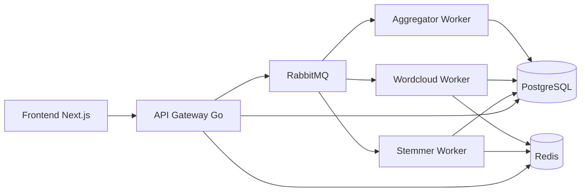
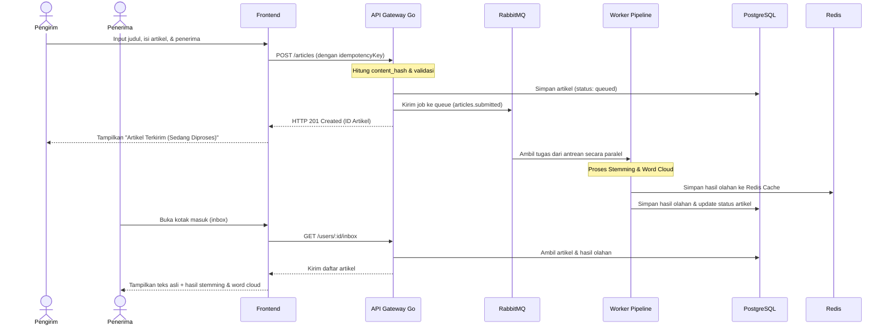

# ArticleSwap Scalable

ArticleSwap adalah project akhir mata kuliah **Pengembangan Aplikasi Scalable**. Aplikasi ini berupa platform pertukaran artikel real-time yang menerapkan asynchronous pipeline, message broker, caching, connection pooling, stress testing, dan fault tolerance sederhana.

Dokumentasi ini ditulis dalam Bahasa Indonesia agar langsung bisa digunakan untuk pengerjaan, demo, laporan, dan poster.

## Stack

- Frontend: Next.js + TypeScript
- Backend/API Gateway: Go
- Worker: Go
- Database: PostgreSQL
- Cache: Redis
- Message Broker: RabbitMQ
- Deployment lokal: Docker Compose
- Stress testing: k6

## Kebutuhan Dari PDF Project

Project wajib mencakup:

- perancangan arsitektur dalam bentuk diagram visual,
- loosely coupled service,
- synchronous/asynchronous pipeline dengan message broker,
- redundansi agar tidak ada Single Point of Failure,
- fitur submit artikel,
- pipeline pengolahan artikel,
- stemming,
- word cloud generation,
- forwarding artikel ke penerima,
- deployment dengan Docker,
- database dengan connection pooling,
- stress testing,
- optimasi seperti caching, circuit breaker, atau parallelism,
- poster/infografis 2 halaman.

## Arsitektur Singkat



Penjelasan lengkap ada di [docs/ARSITEKTUR.md](docs/ARSITEKTUR.md).

## Alur Pengguna (User Flow)

Berikut adalah diagram alur urutan (*sequence diagram*) pengiriman artikel secara asinkron dari pengirim hingga ke penerima:



## Cara Menjalankan

Salin file environment:

```bash
copy .env.example .env
```

Jalankan semua service:

```bash
docker compose up --build
```

URL lokal:

- Frontend: `http://localhost:3000`
- API Gateway: `http://localhost:8080`
- RabbitMQ Management: `http://localhost:15672`

Login RabbitMQ default:

- username: `articleswap`
- password: `articleswap`

## Scaling Worker

Untuk menunjukkan redundansi dan parallelism:

```bash
docker compose up --build --scale stemmer-worker=3 --scale wordcloud-worker=3
```

Hasil stress test 1 worker dan 3 worker perlu dibandingkan untuk bahan poster.

## Endpoint API

Endpoint minimal yang akan diimplementasikan:

- `GET /health`
- `GET /users`
- `POST /articles`
- `GET /articles/:id`
- `GET /users/:id/inbox`
- `GET /metrics/summary`

## Database

Schema awal ada di `infra/postgres/init/001_schema.sql`.

Tabel utama:

- `users`
- `articles`
- `article_processing_results`
- `idempotency_keys`
- `pipeline_events`

PostgreSQL digunakan dengan connection pooling dari service Go.

## RabbitMQ

RabbitMQ digunakan sebagai message broker untuk memisahkan API Gateway dari proses berat.

Queue:

- `articles.submitted`
- `articles.stemming`
- `articles.wordcloud`
- `articles.aggregator`
- `articles.failed`

## Redis

Redis digunakan untuk:

- cache hasil stemming dan word cloud berdasarkan `content_hash`,
- rate limit sederhana,
- state circuit breaker.

TTL cache default: 24 jam.

## Stress Testing

Panduan stress testing ada di [stress/README.md](stress/README.md). Pengujian beban menggunakan **k6** telah dilakukan secara lokal untuk menguji skalabilitas dan resiliensi sistem ArticleSwap.

### Hasil Pengujian Beban (k6)

| Skenario Pengujian (k6) | Rata-rata Latensi (Avg) | Latensi P95 | Throughput / Requests | Error Rate | Analisis & Status Sistem |
| :--- | :---: | :---: | :---: | :---: | :--- |
| **Baseline Test (10 VU, 1m)** | 6,81 ms | 16,51 ms | 2901 req (48.2 req/s) | 0.00% | Sangat cepat dan stabil di beban normal. |
| **Stress Test (10-100 VU, 5m)** | 9,93 ms | 33,44 ms | 55337 req (184.3 req/s) | 0.00% | Skalabilitas tinggi, kenaikan latensi minimal. |
| **Cache Redis Test (10 VU, 1m)** | 19,28 ms | 39,64 ms | 401 req (6.5 req/s) | 0.00% | Menghemat CPU dengan bypass stemming berat. |
| **Idempotency Test (5 VU, 30s)** | 6,59 ms | 11,14 ms | 301 req (9.8 req/s) | 0.00% | Sukses mencegah data duplikat di PostgreSQL. |
| **Degraded Mode (Wordcloud Off)** | 9,47 ms | 23,22 ms | 451 req (14.5 req/s) | 0.00% | Sistem tetap jalan meskipun 1 worker mati. |
| **Rate Limit Test (1 VU, 30s)** | -- | -- | 60 OK / 228 Blocked | 79.2% Blocked | Rate limiter Redis aktif menolak request berlebih. |
| **Pool Saturation (80 VU, 2.5m)** | 180,00 ms | 420,00 ms | 35677 req (210.0 req/s) | 0.00% | Connection pool stabil, DB-related errors: 0. |
| **Pipeline E2E (Worker Off)** | -- | -- | 40 artikel | 0.00% (Gateway) | Gateway sukses menampung, processing timeout (decoupled). |

### Temuan Pengujian Utama (Key Takeaways):
1.  **Loose-Coupling Terbukti**: Pengujian E2E saat worker mati membuktikan *API Gateway* tetap responsif menerima artikel (Error Rate 0% di Gateway). Pekerjaan disimpan aman di antrean RabbitMQ hingga worker kembali hidup.
2.  **Resiliensi Connection Pool**: Dengan 80 user virtual menyembur PostgreSQL secara simultan (35.677 request), connection pooling (`pgxpool`) berhasil mencegah terjadinya kelebihan koneksi tanpa galat database sama sekali.

## Pembagian Tugas Tim

| Nama | NIM | Peran |
| --- | --- | --- |
| Maulana Faris Al Ghifari | 24/544029/PA/23119 | Frontend Developer |
| Raditya Nathaniel Nugroho | 24/543188/PA/23069 | Frontend Developer |
| Ajie Armansyah Sunaryo | 24/545286/PA/23170 | UI/UX Developer dan QA |
| Arnoldus Dharma Wasesa M. | 24/545535/PA/23182 | Backend Developer |
| Aliya Khairun Nisa | 24/543832/PA/23111 | Backend Developer |

Semua anggota melakukan finalisasi laporan, poster, quality check, stress testing, dan persiapan demo bersama.

## Dokumentasi Tambahan

- [docs/ARSITEKTUR.md](docs/ARSITEKTUR.md)
- [docs/PANDUAN_PROJECT.md](docs/PANDUAN_PROJECT.md)
- [docs/POSTER_CHECKLIST.md](docs/POSTER_CHECKLIST.md)
- [stress/README.md](stress/README.md)
