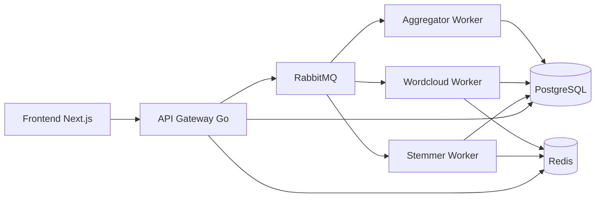

# ArticleSwap Scalable

ArticleSwap adalah project akhir mata kuliah **Pengembangan Aplikasi Scalable**. Aplikasi ini berupa platform pertukaran artikel real-time yang menerapkan asynchronous pipeline, message broker, caching, connection pooling, stress testing, dan fault tolerance sederhana.

Dokumentasi ini ditulis dalam Bahasa Indonesia agar langsung bisa digunakan untuk pengerjaan, demo, laporan, dan poster.

## Stack

- Frontend: Next.js + TypeScript
- Backend/API Gateway: Go
- Worker: Go
- Database: PostgreSQL
- Cache: Redis
- Message Broker: RabbitMQ
- Deployment lokal: Docker Compose
- Stress testing: k6

## Kebutuhan Dari PDF Project

Project wajib mencakup:

- perancangan arsitektur dalam bentuk diagram visual,
- loosely coupled service,
- synchronous/asynchronous pipeline dengan message broker,
- redundansi agar tidak ada Single Point of Failure,
- fitur submit artikel,
- pipeline pengolahan artikel,
- stemming,
- word cloud generation,
- forwarding artikel ke penerima,
- deployment dengan Docker,
- database dengan connection pooling,
- stress testing,
- optimasi seperti caching, circuit breaker, atau parallelism,
- poster/infografis 2 halaman.

## Arsitektur Singkat



Penjelasan lengkap ada di [docs/ARSITEKTUR.md](docs/ARSITEKTUR.md).

## Cara Menjalankan

Salin file environment:

```bash
copy .env.example .env
```

Jalankan semua service:

```bash
docker compose up --build
```

URL lokal:

- Frontend: `http://localhost:3000`
- API Gateway: `http://localhost:8080`
- RabbitMQ Management: `http://localhost:15672`

Login RabbitMQ default:

- username: `articleswap`
- password: `articleswap`

## Scaling Worker

Untuk menunjukkan redundansi dan parallelism:

```bash
docker compose up --build --scale stemmer-worker=3 --scale wordcloud-worker=3
```

Hasil stress test 1 worker dan 3 worker perlu dibandingkan untuk bahan poster.

## Endpoint API

Endpoint minimal yang akan diimplementasikan:

- `GET /health`
- `GET /users`
- `POST /articles`
- `GET /articles/:id`
- `GET /users/:id/inbox`
- `GET /metrics/summary`

## Database

Schema awal ada di `infra/postgres/init/001_schema.sql`.

Tabel utama:

- `users`
- `articles`
- `article_processing_results`
- `idempotency_keys`
- `pipeline_events`

PostgreSQL digunakan dengan connection pooling dari service Go.

## RabbitMQ

RabbitMQ digunakan sebagai message broker untuk memisahkan API Gateway dari proses berat.

Queue:

- `articles.submitted`
- `articles.stemming`
- `articles.wordcloud`
- `articles.aggregator`
- `articles.failed`

## Redis

Redis digunakan untuk:

- cache hasil stemming dan word cloud berdasarkan `content_hash`,
- rate limit sederhana,
- state circuit breaker.

TTL cache default: 24 jam.

## Stress Testing

Panduan stress testing ada di [stress/README.md](stress/README.md).

Skenario yang disiapkan:

- baseline 10 virtual users,
- stress naik sampai 100 virtual users,
- cache test,
- idempotency test,
- degraded mode test.

Metrik yang dicatat:

- average latency,
- P95 latency,
- P99 latency,
- throughput,
- error rate,
- cache hit,
- jumlah artikel sukses/gagal.

## Pembagian Tugas Tim

| Nama | NIM | Peran |
| --- | --- | --- |
| Maulana Faris Al Ghifari | 24/544029/PA/23119 | Frontend Developer |
| Raditya Nathaniel Nugroho | 24/543188/PA/23069 | Frontend Developer |
| Ajie Armansyah Sunaryo | 24/545286/PA/23170 | UI/UX Developer dan QA |
| Arnoldus Dharma Wasesa M. | 24/545535/PA/23182 | Backend Developer |
| Aliya Khairun Nisa | 24/543832/PA/23111 | Backend Developer |

Semua anggota melakukan finalisasi laporan, poster, quality check, stress testing, dan persiapan demo bersama.

## Dokumentasi Tambahan

- [docs/ARSITEKTUR.md](docs/ARSITEKTUR.md)
- [docs/PANDUAN_PROJECT.md](docs/PANDUAN_PROJECT.md)
- [docs/POSTER_CHECKLIST.md](docs/POSTER_CHECKLIST.md)
- [stress/README.md](stress/README.md)
