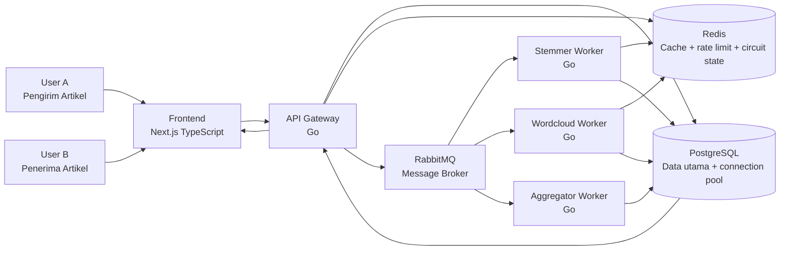

# Arsitektur ArticleSwap

Dokumen ini menjadi referensi utama untuk diagram arsitektur, poster, dan implementasi teknis.

## Tujuan Arsitektur

ArticleSwap dibuat untuk menunjukkan penerapan konsep dari Bab 10 dan Bab 11:

- optimasi kinerja aplikasi,
- asynchronous processing,
- connection pooling,
- caching,
- stress testing,
- loosely coupled service,
- fault tolerance,
- retry,
- circuit breaker,
- idempotency,
- dan high availability sederhana melalui scaling worker.

## Diagram Visual



## Alur Submit Artikel

1. Pengirim memilih penerima dan mengisi judul serta isi artikel.
2. Frontend mengirim request ke API Gateway dengan `idempotencyKey`.
3. API Gateway memvalidasi request, membuat `content_hash`, dan menyimpan artikel status `queued`.
4. API Gateway memasukkan job ke RabbitMQ.
5. API Gateway langsung mengembalikan respons ke frontend agar pengguna tidak menunggu proses berat.
6. Worker memproses stemming dan word cloud secara asynchronous.
7. Hasil proses disimpan ke PostgreSQL dan Redis.
8. Aggregator mengubah status artikel menjadi `processed`, `degraded`, atau `failed`.
9. Penerima melihat artikel mentah lebih dulu, lalu hasil proses muncul setelah selesai.

## Loosely Coupled

Setiap fitur berat dipisah menjadi worker sendiri. Jika wordcloud worker gagal, artikel tetap dapat dikirim dan dibaca. Dampak kegagalan menjadi terbatas pada fitur word cloud saja.

## Redundansi

Redundansi lokal ditunjukkan dengan menjalankan beberapa replika worker:

```bash
docker compose up --scale stemmer-worker=3 --scale wordcloud-worker=3
```

Pendekatan ini menunjukkan horizontal scaling dan mengurangi risiko worker tunggal menjadi bottleneck.

## Optimasi

Optimasi yang wajib dibuktikan:

- RabbitMQ sebagai buffer trafik.
- Redis cache berdasarkan hash konten artikel.
- PostgreSQL connection pooling.
- Retry dengan exponential backoff dan jitter.
- Circuit breaker sederhana.
- Stress testing sebelum dan sesudah scaling/cache.

